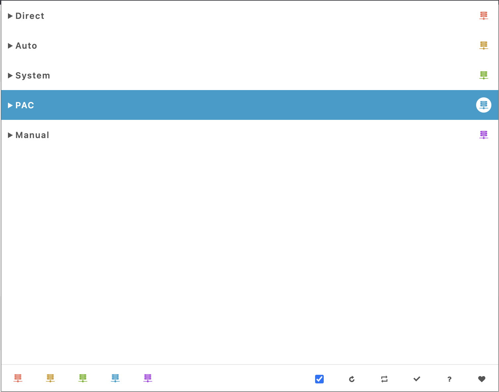
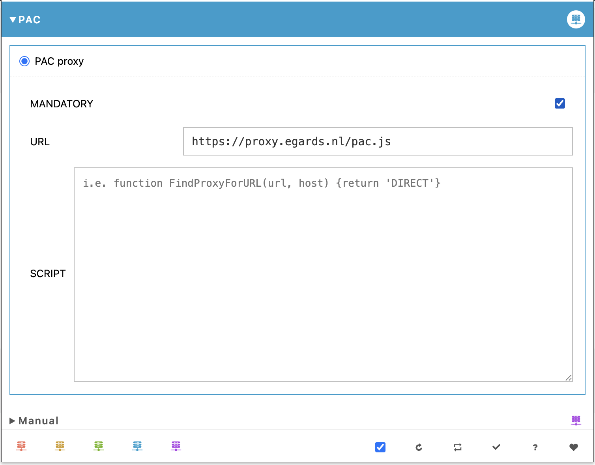

# Egards VPN Proxy

This document explains how to use a VPN proxy to access various Egards services, such as ParkXS.

## Browser Extension

The recommended browser extension for the proxy is **Proxy Switcher**, which can be found on the 
[Chrome Web Store](https://chromewebstore.google.com/detail/proxy-switcher/iejkjpdckomcjdhmkemlfdapjodcpgih). To ensure that the extension is active, it should be **pinned**.



## Configuration

The proxy can be configured using a Proxy Auto-Config (PAC) file. For Egards, the PAC file has already been created 
and is available at the URL below.

### PAC URL

```
https://proxy.egards.nl/pac.js
```

To complete the configuration, select PAC in the browser extension and enter the PAC URL.



## Using the VPN Proxy
To use the proxy, simply visit Egards applications such as ParkXS. In Chrome, this will trigger a pop-up requesting your proxy username and password. Once the correct credentials are entered and accepted, they will be automatically set for future visits.

For proxy username and password, please contact the Egards Administrator.